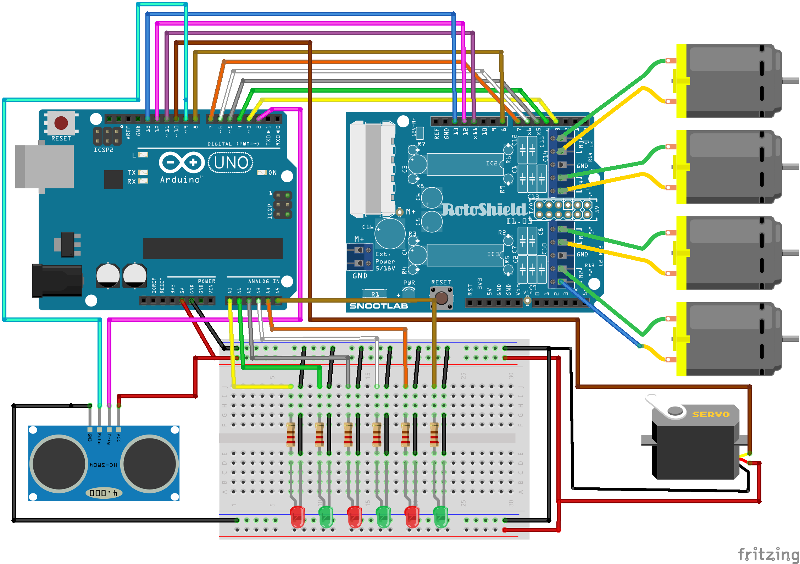

# Carro Autónomo Arduino
Carro de conducción autónoma mediante shell controlador de motores y uso del sensor ultrasónico, se diseñó con fines de aprendizaje, como parte de las actividades del tiempo libre durante la Pandemia del 2020. Forma parte del desarrollo de ITIC en ITSOEH, y se presenta como proyecto interno para su evaluación y para publicación de documentos tipo papers.

Desarrollado por: Christian Elías Cruz González.

## Comenzando :rocket:

Para poder replicar este proyecto necesitarás:

* Un arduino UNO
* Un shell controlador de motores
* Un sensor ultrasónico
* Un servomotor
* Un switch
* Cuatro motores con llantas
* Leds (Para este modelo se utilizan 3 rojos y 3 verdes).

El siguiente diagrama ilustra la forma en que deben realizarse las conexiones necesarias.

 

